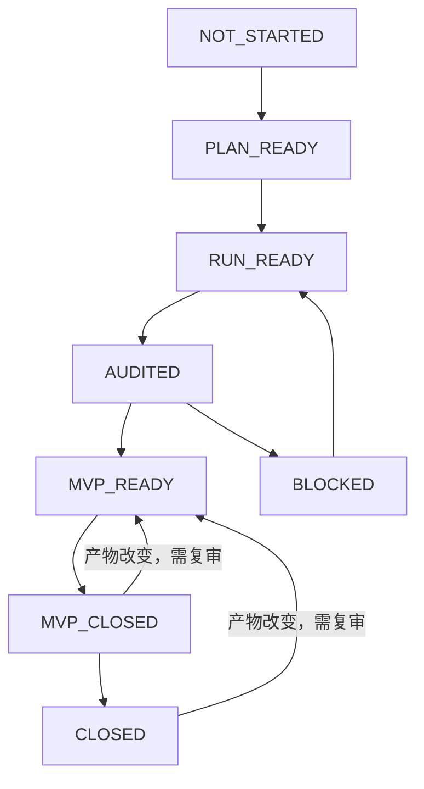

# GMCM 从开赛到交付

赛前 clone SkillPack、运行 install/verify，并在临时项目演练。仅赛前主动更新；比赛中冻结工具链。总原则是 Problem first、Evidence first、Complete first → Validate → Improve。

固定唯一流程：

```text
contest-project-bootstrap
→ data-contract-auditor
→ modeling-reviewer
→ optional exemplar-paper-retriever
→ model/code
→ result-auditor
→ verified-number-registry
→ question-completion-gate
→ repo-paper-auditor
→ paper-handoff
→ paper
→ PaperSpine if useful
→ gmcm-final-reviewer
```

MathModel Standard 继续提供项目级原子工作能力，sci-box 负责图，PaperSpine 只在论文整合确有收益时使用。本仓库不引入另一套数学建模 orchestrator。比赛推进单位是 `each question → MVP_CLOSED → next question → later improvement`。

## Evidence-calibrated communication

五个现有 Skill 共同执行 [Evidence-Calibrated Communication Policy](../rubrics/evidence_calibrated_communication.md)，总原则为 **Evidence > Rhetoric**。modeling-reviewer 防止防御性加模型；result-auditor 校准结果强弱；paper-handoff 交付允许表达和必须保留的限制；repo-paper-auditor 核对 claim 与证据及代码/README 表达；gmcm-final-reviewer 检查叙事、重复和最终表达。

删减模板表达、空泛自我削弱和重复观点，不得隐藏负结果、删除真实局限或提高证据强度。AI detector、AI score、降低 AI 检测率或绕过 AI 检测均不得作为目标或质量指标。终审将 `UNJUSTIFIED_HEDGING` 与应保留的 `VALID_LIMITATION` 分开记录；摘要缺 Problem/Method/Result 为 MAJOR，仍不通过硬门。competition_mode 优先证据和作答缺口，不在 MINOR 措辞上花大量时间。

## 论文内容契约与 PaperSpine integration

`paper-handoff` 和 `gmcm-final-reviewer` 共同执行 `rubrics/paper_narrative.md`。PaperSpine 是可选的下游写作/整合器，不重新选模、不重新计算数字，也不替代 GMCM 证据关卡；其通用 contribution/motivation 逻辑不能覆盖逐问 Problem–Method–Result 和数学叙事要求。

下游写作与改写同时接收 communication Policy 和 handoff 中的允许表达/禁止表达/必须保留的限制；三要素是信息结构，不强制句式。润色不能覆盖 Evidence Matrix 的推断范围。

当使用 PaperSpine 且 `scene=competition` 时，在 drafting/rewrite 前把当前 GMCM 产物映射到它已有的产物，不新增 stage 或 orchestrator：

| GMCM source of truth | PaperSpine destination/use |
|---|---|
| 官方题目、当年规则、`rubrics/gmcm.md`、`rubrics/paper_narrative.md` | competition scene constraints / section blueprints |
| `notes/handoff_qN.md` | 逐问 Problem → abstraction → formulation/selection → computation → result/interpretation → validation → conclusion → next link |
| `reports/evidence_matrix.md` + code/config/result | `evidence_bank.md`、`claim_register.md` 与 writing rationale 的 evidence anchor |
| `results/paper_metrics.yaml` 中批准条目 | 正文与摘要唯一关键数字来源 |
| handoff 的 Formula Context Ledger | 公式前因、表达、变量/意义/后续用途写作单元 |
| handoff 的 Figure and Table Evidence Ledger | `figure_asset_map.md` 及 Purpose–Observation–Interpretation–Implication 写作单元 |
| handoff 的摘要行 | 摘要逐问 Problem–Method–Result；三项缺一不得完成 |

优秀论文和 PaperSpine 的 exemplar 只学习章节组织、数学叙事、结果解释、验证写法和摘要结构，不复制或近似改写原文。PaperSpine 产出后仍必须运行 `gmcm-final-reviewer`；其通用 final audit 不能代替 GMCM 内容终审。

常用起始提示：

```text
使用 $contest-project-bootstrap 检查当前比赛项目、官方材料和 J/F/L 接口。
使用 $data-contract-auditor 在不修改 data/raw 的前提下检查原始与处理数据契约。
使用 $modeling-reviewer 审查第一问，比较候选路线并给出 baseline 和 MVP。
必要时使用 $exemplar-paper-retriever 按数学结构检索最多三篇案例。
使用 $result-auditor 检查真实运行、泄漏、指标、约束与验证。
使用 $verified-number-registry 批准可进入论文的核心数字。
使用 $question-completion-gate 判断该问是否已达到 MVP_CLOSED。
使用 $repo-paper-auditor 建立题目到论文 claim 的 Evidence Matrix。
使用 $paper-handoff 将已审计的问题交给 L。
使用 $gmcm-final-reviewer 审查数学、实验、逐问叙事、摘要 PMR 与证据一致性。
```

原始数据 → 处理代码 → 实验配置/种子 → 结果 → registry → 图表 → Evidence Matrix → handoff → 正文/摘要，每一环必须可定位。BLOCKED 主结论不可写成正式结果；负 R²、弱关系和失败实验保留并解释。

上游目录与模板不同时，在 `project/project-layout.md` 记录实际映射和唯一提交稿。比赛开始后按 [competition-freeze.md](competition-freeze.md) 冻结流程。

## 执行状态机（导航层）



PLAN_READY / RUN_READY / AUDITED 是 readiness 里程碑，对外 question status 归为 PARTIAL；
MVP_READY 表示产物齐备，MVP_CLOSED/CLOSED 必须有匹配当前产物指纹的 question-completion-gate verdict。
BLOCKED 不可通过手改缓存解除。初次 gate 可记录 PARTIAL 和下游缺口，按原顺序完成 repo-paper-auditor、handoff 后复验同一关卡。

`mm` 只是控制/导航层，不创建第二套流程。`mm status` 从产物推导，`mm next` 给一个下一步，
`mm gate` 只做 deterministic precheck，`mm refresh` 只更新 navigation cache。
[Source-of-truth 与机器字段](execution-cli.md)、[Routing Matrix](skill-routing.md)、[72h Runbook](gmcm-72h-runbook.md)。
